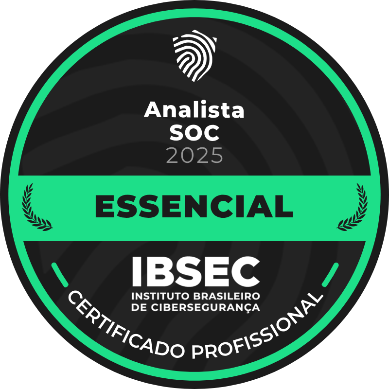
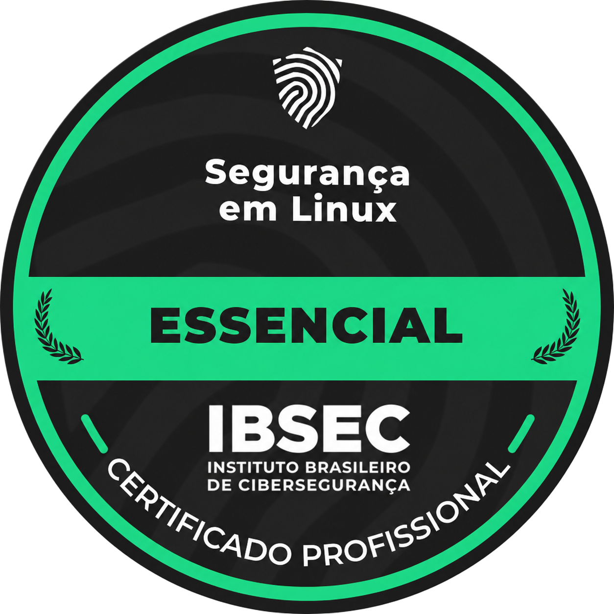

# 🇧🇷 [Português](#portugues) | 🇺🇸 [English](#english)

## 👋 Bem-vindo ao meu perfil no GitHub

Olá! Eu sou o **Henrique**, um entusiasta de tecnologia de 20 anos do Brasil 🇧🇷.  
Ex-aluno do **IFC - Campus São Bento do Sul**, onde concluí o **Ensino Médio Técnico em Informática**.

Sou **autista (nível 1)**, com **Síndrome de Savant sob investigação**, e sempre tive um interesse profundo em **microcontroladores**, **programação de baixo nível** e em entender como as coisas funcionam em sua essência.

---

## 🧠 Sobre Mim

- 🔩 Apaixonado por **microcontroladores** e **sistemas embarcados**
- 🌐 **Portfólio:** [hc8841.github.io](https://hc8841.github.io)
- 📄 **Currículos e Certificados:** [Acesse aqui](https://drive.google.com/drive/folders/1k7mJwBy7egEE-h_HCGNXxc6mR8M9QGmY)
- 🧠 Amante de **Filosofia**, especialmente as obras de **Nietzsche** e **Schopenhauer**
- 📡 **Radioamador** licenciado – indicativo **PU5HEF**
- 🔧 Interessado em **desenvolvimento de baixo nível**, debugging e engenharia reversa
- 💬 **Idiomas:** Minha leitura em inglês é boa, mas ainda estou praticando a fala e a escuta.

---

## 💻 Tech Stack

### 🚀 Programação e Baixo Nível

### 🔩 Hardware e Sistemas Embarcados

### 🐧 SO e Ferramentas

---

## 🛡️ Certificações (IBSEC)

  
  
  
  

---

## 📡 Radioamadorismo

Também sou um **radioamador** licenciado 🇧🇷  
**Indicativo:** `PU5HEF`  
Sinta-se à vontade para entrar em contato se você também curte rádio!

---

## 📫 Contato

**E-mail (Principal):** [henriquemattos841@gmail.com](mailto:henriquemattos841@gmail.com)  
**E-mail (Secundário):** [medusa0841@proton.me](mailto:medusa0841@proton.me)

---

> "Na computação e na vida, somos eternos iniciantes." — *Henrique Chaves*

  

## 👋 Welcome to my GitHub Profile

Hey! I'm **Henrique**, a 20-year-old tech enthusiast from Brazil 🇧🇷.  
Former student at **IFC - São Bento do Sul**, where I completed my **Technical High School in Computer Science**.

I'm **autistic (level 1)**, with **Savant Syndrome under investigation**, and I've always had a deep interest in **microcontrollers**, **low-level programming**, and understanding how things work at their core.

---

## 🧠 About Me

- 🔩 Passionate about **microcontrollers** and **embedded systems**
- 🌐 **Portfolio:** [hc8841.github.io](https://hc8841.github.io)
- 📄 **Resume & Certificates:** [Access here](https://drive.google.com/drive/folders/1k7mJwBy7egEE-h_HCGNXxc6mR8M9QGmY)
- 🧠 Lover of **Philosophy**, especially the works of **Nietzsche** and **Schopenhauer**
- 📡 Licensed **ham radio operator** – callsign **PU5HEF**
- 🔧 Into **low-level development**, debugging, and reverse engineering
- 💬 **Languages:** My English reading is solid, but I'm still working on my speaking and listening skills.

---

## 💻 Tech Stack

### 🚀 Programming & Low-Level

### 🔩 Hardware & Embedded Systems

### 🐧 OS & Tools

---

## 🛡️ Certifications (IBSEC)

  
  
  
  

---

## 📡 Ham Radio

I'm also a licensed **ham radio operator** 🇧🇷  
**Callsign:** `PU5HEF`  
Feel free to reach out if you’re into radio stuff too!

---

## 📫 Contact Me

**Email (Primary):** [henriquemattos841@gmail.com](mailto:henriquemattos841@gmail.com)  
**Email (Secondary):** [medusa0841@proton.me](mailto:medusa0841@proton.me)

---

> "In computing and in life, we are eternal beginners." — *Henrique Chaves*
