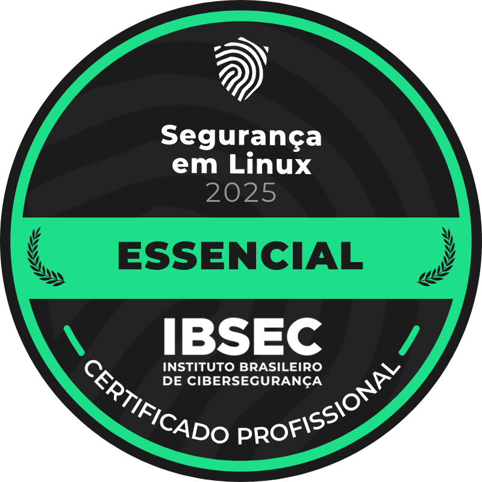
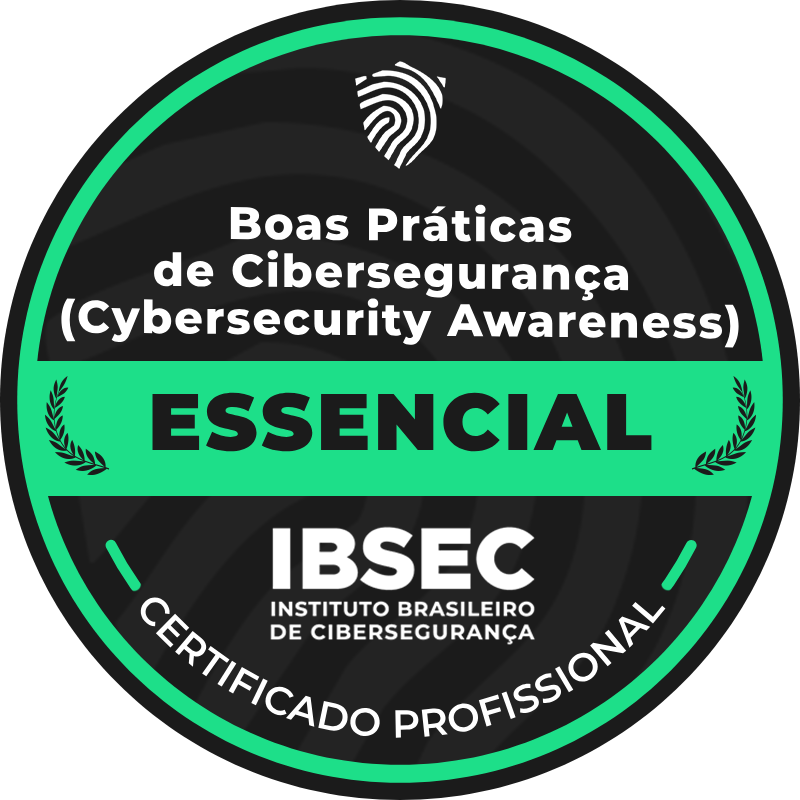

## 👋 Welcome to my GitHub Profile

Hey! I'm **Henrique**, a 20-year-old tech enthusiast from Brazil 🇧🇷.  
Former student at **IFC - São Bento do Sul**, where I completed my **Technical High School in Computer Science**.

I'm **autistic (level 1)**, with **Savant Syndrome under investigation**, and I've always had a deep interest in **microcontrollers**, **low-level programming**, and understanding how things work at their core.

I'm also fluent in **English**, so feel free to connect!

---

## 🧠 About Me

- 🔩 Passionate about **microcontrollers** and **embedded systems**
- 🧠 Lover of **Philosophy**, especially the works of **Nietzsche** and **Schopenhauer**
- 📡 Licensed **ham radio operator** – callsign **PU5HEF**
- 🔧 Into **low-level development**, debugging, and reverse engineering
- 💬 I speak **English** fluently

---

## 💻 Tech Stack

### 🚀 Programming & Low-Level

### 🔩 Hardware & Embedded Systems

### 🐧 OS & Tools

---

## 🛡️ Certifications (IBSEC)

  
  

---

## 🏆 GitHub Trophies

---

## 📂 Recent Activity

---

## 📡 Ham Radio

I'm also a licensed **ham radio operator** 🇧🇷  
**Callsign:** `PU5HEF`  
Feel free to reach out if you’re into radio stuff too!

---

## 📫 Contact Me

**Email (Primary):** [henriquemattos841@gmail.com](mailto:henriquemattos841@gmail.com)  
**Email (Secondary):** [henriquepu5hef@gmail.com](mailto:henriquepu5hef@gmail.com)

---

> "I see technology not just as a tool, but as a philosophy. The deeper we go, the more we understand ourselves."
